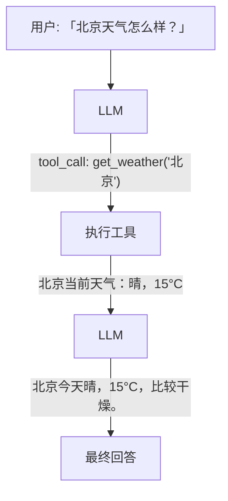
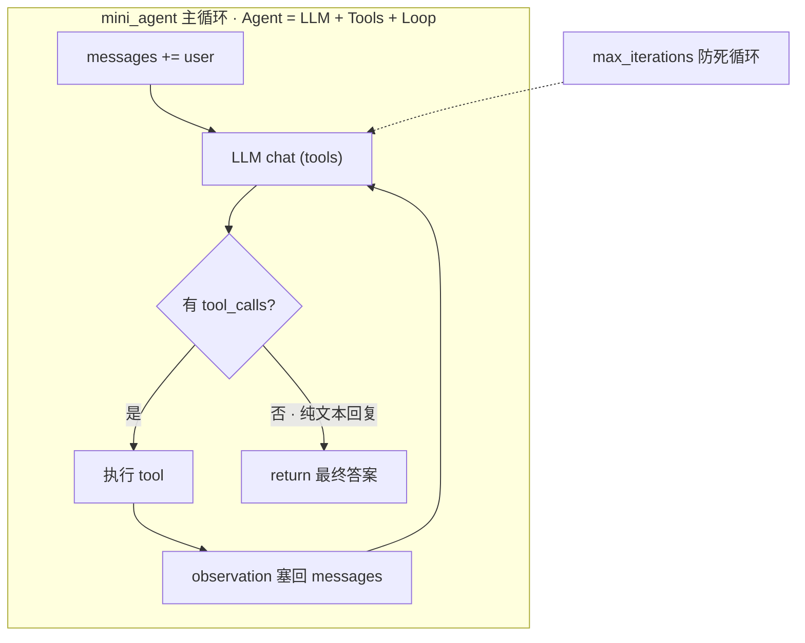
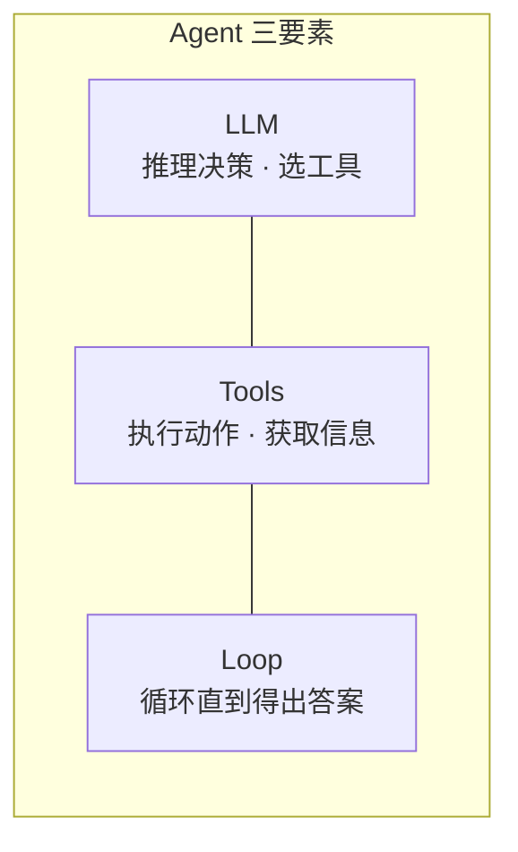

# 第 1 周：LLM 与 Agent 基础

> 目标：搞懂 Agent 是什么，跑通第一个 LLM 调用，手写最小 Agent 循环。

## 快速开始

```bash
cd experiments
python3 -m venv .venv && source .venv/bin/activate
pip install -r requirements.txt
cp .env.example .env   # 填入 DEEPSEEK_API_KEY
cd week1
python 00_python_warmup.py
```

API Key 在 [DeepSeek 开放平台](https://platform.deepseek.com/) 注册获取。

## 学习路径

```
Day 0              Day 1-2                Day 3-4              Day 5+
  │                  │                      │                    │
  ▼                  ▼                      ▼                    ▼
warmup           llm_hello            structured_output    function_call
                 + 概念 1.x            + 提示工程 2.x              │
                                                                 ▼
                                                            mini_agent
                                                            (ReAct 循环)
```

| 顺序 | 文件 | 对应 checklist |
|------|------|----------------|
| 0 | `00_python_warmup.py` | 0.1, 0.2 |
| 1 | `llm_hello.py` | 1.x, 3.1 |
| 2 | `structured_output.py` | 2.1–2.3 |
| 3 | `function_call.py` | 3.2 |
| 4 | `mini_agent.py` | 3.3 |

---

## 0. Python 预热

### 实验：00_python_warmup.py

**运行**：`python 00_python_warmup.py`

**目标**：熟悉 Python 与 Node.js 的关键差异。

| Python | Node.js 对照 | 用途 |
|--------|-------------|------|
| `def fn(x: str) -> str` | TypeScript 类型注解 | 函数签名 |
| `async def` + `await` | `async/await` | 异步 IO |
| `Pydantic BaseModel` | class-validator + DTO | 数据校验 |

**思考题**：
- Python 的 `Optional[str]` 对应 TypeScript 的什么类型？
- Pydantic 校验失败时抛出什么异常？

<details>
<summary>参考答案</summary>

- **`Optional[str]`** 等价于 `str | None`，对应 TypeScript 的 `string | null | undefined`（或 `string?`）。见 `00_python_warmup.py` 中 `find_user` 的注释。
- 校验失败时抛出 **`pydantic.ValidationError`**，可通过 `e.error_count()` 查看错误数量。

</details>

---

## 1. LLM 基础认知

### 1.1 Token 与上下文窗口

- **Token**：LLM 处理文本的最小单位（约 1 token ≈ 0.75 个英文单词 ≈ 0.5 个汉字）
- **上下文窗口**：模型一次能「看到」的最大 token 数（DeepSeek-V3 约 64K）
- **计费**：按 input + output token 数计费，DeepSeek 约 ¥1/百万 input tokens

### 1.2 采样参数

| 参数 | 作用 | 建议 |
|------|------|------|
| `temperature` | 控制随机性，0=确定性，1=创造性 | 事实问答用 0，创意写作用 0.7+ |
| `top_p` | 核采样，限制候选 token 范围 | 一般与 temperature 二选一调 |
| `max_tokens` | 限制输出长度 | 防止超长回复 |

### 1.3 模型选型速查

| 模型 | 特点 | 成本 |
|------|------|------|
| DeepSeek-V3 | 国内、便宜、OpenAI 兼容 | ⭐ 低 |
| GPT-4o | 能力强、生态好 | ⭐⭐⭐ 高 |
| Claude 3.5 | 长上下文、代码强 | ⭐⭐⭐ 高 |
| 通义千问 | 国内、阿里云生态 | ⭐⭐ 中 |
| Kimi | 超长上下文（200K+） | ⭐⭐ 中 |

### 1.4 能力边界

- **幻觉**：LLM 会自信地编造不存在的信息
- **知识截止**：训练数据有时间边界，不知道最新事件
- **不会算数**：复杂计算容易出错
- **结论**：需要 **工具调用**（查天气、搜网页）和 **RAG**（检索私有知识）来补足

---

## 2. 提示工程入门

### 2.1 消息角色

```
┌─────────────────────────────────────┐
│  messages 数组                       │
├─────────────────────────────────────┤
│  system    → 设定 AI 行为和角色       │
│  user      → 用户的输入              │
│  assistant → AI 的历史回复           │
│  tool      → 工具执行结果（Function   │
│              Calling 场景）           │
└─────────────────────────────────────┘
```

### 2.2 Few-shot 与 CoT

- **Few-shot**：在 prompt 中给几个示例，让 LLM 模仿格式
- **CoT（思维链）**：要求 LLM「一步步思考」，提升推理准确率

CoT 示例 prompt：
```
请按以下步骤分析：
1. 识别评论中的情感词
2. 判断整体倾向
3. 给出评分

然后输出 JSON: {"rating": ..., "sentiment": ..., "summary": ...}
```

### 2.3 实验：structured_output.py

**运行**：`python structured_output.py`

**目标**：让 LLM 输出结构化 JSON，用 Pydantic 校验。

**观察**：
- `response_format={"type": "json_object"}` 强制 JSON 输出
- `MovieReview.model_validate_json()` 解析并校验
- CoT prompt 如何提升分析质量

**思考题**：
- 如果 LLM 返回的 JSON 缺少必填字段，Pydantic 会怎样？
- 为什么 Agent 应用需要结构化输出而不只是自然语言？

<details>
<summary>参考答案</summary>

- `MovieReview.model_validate_json()` 会抛出 **`ValidationError`**，说明缺少哪个字段或类型/范围不合法（如 `rating` 不在 1–10）。
- Agent 下游常需**程序化处理**（路由、写库、调 API、多步编排），自然语言难以稳定解析；结构化输出提供**可校验的契约**，减少幻觉和解析失败。

</details>

---

## 3. 从调用到 Agent

### 3.1 实验：llm_hello.py

**运行**：`python llm_hello.py`

**目标**：跑通第一次 DeepSeek API 调用。

**观察**：
- messages 数组的结构
- token 用量（prompt_tokens / completion_tokens）
- temperature=0 vs temperature=1 的输出差异

**思考题**：
- 为什么 Agent 应用需要关注 token 用量？
- system prompt 对输出风格有多大影响？试着改改看效果。

<details>
<summary>参考答案</summary>

- **成本**（按 token 计费）、**上下文窗口**（多轮对话 + 工具结果会快速累积）、**延迟**（token 越多越慢），以及工程上的历史裁剪、摘要、选模型等决策。
- 影响很大。`llm_hello.py` 中 system 要求「简洁、不超过 50 字」会明显缩短输出；改成「详细解释」则风格相反。system 相当于**全局行为设定**。

</details>

### 3.2 实验：function_call.py

**运行**：`python function_call.py`

**目标**：理解 Function Calling 的单次流程。



**观察**：
- LLM 如何「决定」调用哪个工具
- `tool` 角色的 message 如何把结果回传给 LLM
- 工具 schema 的定义方式

**思考题**：
- 如果用户问「今天适合出门吗」，LLM 会调用工具吗？
- 工具 schema 的 description 字段有什么作用？

<details>
<summary>参考答案</summary>

- **不一定**。问题未指定城市，模型可能先追问、给泛泛建议而不调工具，或在 system 引导下假设默认城市后调用 `get_weather`。`function_call.py` 的 `main()` 用的就是这个问题，跑一次可观察实际行为。
- `description` 是给 LLM 的**工具说明书**，说明何时用、能做什么；写清楚（如「查询指定城市的当前天气信息…」）时，模型更容易在需要实时数据时选中正确工具。参数里的 `city` description 也帮助正确填参。

</details>

### 3.3 实验：mini_agent.py

**运行**：`python mini_agent.py`

**目标**：手写 ReAct Agent 循环，理解 Agent 的核心机制。



**观察**：
- 比较两城市温度需要 **两次** tool_call
- 每次 iteration 的 Action 和 Observation
- max_iterations 如何防止死循环

**思考题**：
- function_call.py 和 mini_agent.py 的核心区别是什么？
- 如果 LLM 陷入重复调用同一工具的循环，怎么解决？
- 第 2 周用 LangGraph 重写时，这些概念对应什么？

<details>
<summary>参考答案</summary>

- **`function_call.py`**：无循环，固定「LLM → 工具 → LLM」一次。**`mini_agent.py`**：有 `for` 循环，可多次 tool_call（如比较两城温度需查两次），直到 LLM 不再返回 `tool_calls` 或达到 `MAX_ITERATIONS`。
- 设置 **`max_iterations` 上限**；检测同一工具+相同参数重复 N 次则中断或注入提示；改 prompt 要求不重复查询；降低 temperature；LangGraph 侧用 `recursion_limit`。
- 对照 `experiments/week2/agent_langgraph.py`：`messages` → `AgentState`；LLM 调用 → `agent_node`；工具执行 → `ToolNode`；`if tool_calls` → `route_after_agent` 条件边；`for` 循环 → `agent → tools → agent` 回边；`MAX_ITERATIONS` → `recursion_limit`。

</details>

---

## 4. 核心概念



- **LLM**：大脑，负责理解意图、规划步骤、生成回答
- **Tools**：手脚，查天气、搜网页、写文件等外部能力
- **Loop**：心跳，反复「思考→行动→观察」直到任务完成

---

## 5. 本周思考题

1. Agent 和普通 ChatBot 的本质区别是什么？
2. 为什么第一周要手写 ReAct 循环而不是直接用 LangGraph？
3. Function Calling 的 tool schema 相当于什么编程概念？（提示：类似 API 的什么？）
4. 如果 LLM 返回了格式错误的 JSON，你的应用应该怎么处理？
5. temperature=0 一定比 temperature=1 好吗？什么场景需要高 temperature？

<details>
<summary>参考答案</summary>

1. **ChatBot** 通常是单轮或固定多轮对话，LLM 只生成文本。**Agent** 还有 **Tools + Loop**，能主动决策调用外部能力、多步执行直到任务完成（LLM + Tools + Loop 三要素）。
2. 先理解底层机制（messages 累积、tool 回传、循环终止、防死循环），再用框架；没手写经验时调试 LangGraph 节点/状态/条件边会更难。
3. 类似 **OpenAPI 接口文档**（或 TS 函数签名 + JSDoc）：声明函数名、用途、参数类型与必填项；LLM 像动态客户端，你的代码是服务端实现。
4. **预防**：`response_format={"type": "json_object"}`；**解析**：`model_validate_json()` 捕获 `ValidationError`；**恢复**：重试或 strip markdown 代码块；**降级**：默认值 / 友好错误 / 打日志。
5. 不是。**temperature=0** 适合事实问答、工具选择、结构化输出；**高 temperature** 适合创意写作、头脑风暴等需要多样性的场景。见 `llm_hello.py` Demo 2 对比。

</details>

---

## 6. 常见坑

| 问题 | 原因 | 解决 |
|------|------|------|
| `DEEPSEEK_API_KEY` 未找到 | 未配置 .env | 复制 `.env.example` 并填入 Key |
| `ModuleNotFoundError: _config` | 不在 week1 目录运行 | `cd experiments/week1` 后执行 |
| LLM 不调用工具 | tool description 不清晰 | 完善 schema 的 description |
| Agent 死循环 | 无 iteration 上限 | 设置 max_iterations |
| JSON 解析失败 | LLM 输出夹带 markdown | 用 `response_format={"type": "json_object"}` |

---

## 7. 下周预告

第 2 周将用 **LangGraph** 重写 mini_agent，并引入 **RAG** 和 **记忆机制**：

- LangGraph 节点、状态、条件分支
- Embedding + 向量数据库
- 短期/长期记忆管理
- MCP（Model Context Protocol）认知

继续加油！
