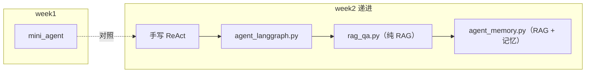
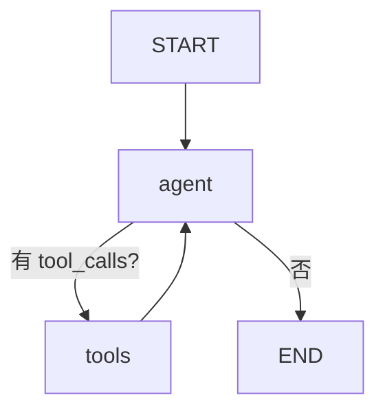

# 第 2 周：框架 + RAG

> 目标：掌握 LangGraph 编排、RAG 检索增强与 Agent 记忆机制。

## 快速开始

```bash
cd experiments
source .venv/bin/activate
pip install -r requirements.txt   # 含 week2 新依赖
# 确保 experiments/.env 已配置 DEEPSEEK_API_KEY

# 单元测试（TDD，无需 API）
pytest tests/ -v

cd week2
python agent_langgraph.py
python rag_qa.py
python agent_memory.py   # 多轮 CLI，输入 quit 退出
```

**首次运行 RAG**：会下载 FastEmbed 模型 `BAAI/bge-small-zh-v1.5`，请保持网络畅通。

## 学习路径



| 顺序 | 文件 | 对应 checklist |
|------|------|----------------|
| 1 | `agent_langgraph.py` | 1.2, 1.3 |
| 2 | `rag_qa.py` | 2.1–2.4 |
| 3 | `agent_memory.py` | 3.1–3.3 |

---

## 1. 框架入门

### 1.1 框架选型对比

| 框架 | 擅长 | 本周角色 |
|------|------|----------|
| **LangGraph** | Agent 状态机、循环、分支 | 主力编排 |
| **LangChain** | Loader、Splitter、VectorStore 积木 | RAG 管线 |
| **LlamaIndex** | 文档索引抽象 | 了解即可，本次不默认 |

### 1.2 实验：agent_langgraph.py

**运行**：`python agent_langgraph.py`

**对照 week1**：打开 `week1/mini_agent.py`，比较：

- `for` 循环 → Graph 的 `agent` / `tools` 节点
- `if tool_calls` → `conditional_edges`
- `messages` 列表 → `State` + `add_messages`

**观察**：控制台中的多轮工具调用与 Final Answer。

### 1.3 Agent 编排概念



---

## 2. RAG 核心

### 2.1 Embedding

- 将文本变为向量，语义相近的文本向量距离更近
- 本实验默认：FastEmbed 本地模型 `BAAI/bge-small-zh-v1.5`（无需 PyTorch 2.4+）

### 2.2 向量数据库 Chroma

- 持久化目录：`week2/.chroma/`（已 gitignore）
- 流程：Document → embedding → 存储 → similarity_search

### 2.3 RAG 流程

切分（`lib/rag.split_markdown`）→ 向量化 → 检索 → 注入 system prompt → LLM 生成

### 2.4 实验：rag_qa.py

**运行**：`python rag_qa.py`

**观察**：打印的 `[1] source=sample.md | ...` 检索片段。

**试一问**：`第 2 周的学习产出是什么？`

---

## 3. 记忆机制

| 类型 | 实现 | 位置 |
|------|------|------|
| 短期 | `trim_messages` 裁剪历史 | `lib/history.py` |
| 长期 | `MemoryStore` JSON | `week2/.memory/store.json` |
| 工具 | `remember_fact` | `agent_memory.py` |

### 3.3 实验：agent_memory.py

**运行**：`python agent_memory.py`

**建议试炼**：

1. 问：`第 2 周产出是什么？`（测 RAG）
2. 说：`请记住 name 是小明`（测长期记忆）
3. 问：`我叫什么？`（测召回）

---

## 4. MCP 认知

**Model Context Protocol**：标准化「Host ↔ Server ↔ Tool」。

| | Function Calling | MCP |
|--|------------------|-----|
| 范围 | 应用内函数 | 进程外服务 |
| 例子 | `get_weather()` | Cursor 里的 Git / 飞书 MCP |

你在 Cursor 中已在使用 MCP；第 2 周理解协议即可，无需自建 Server。

---

## 5. 自动化测试（TDD）

```bash
cd experiments && pytest tests/ -v
```

测试覆盖：`history`、`memory_store`、`rag`、`routing`（使用 `FakeEmbeddings`，无需 API）。

---

## 6. 思考题

1. LangGraph 相比手写 `while` 循环，最大收益是什么？代价是什么？
2. RAG 检索不准时，应先调 chunk 还是换 embedding？
3. 长期记忆和 RAG 知识库各适合存什么？
4. MCP 与 Function Calling 在架构上如何分工？

---

## 7. 常见坑

| 问题 | 原因 | 解决 |
|------|------|------|
| `ModuleNotFoundError: lib` | 未在 week2 或未跑 pytest | `cd week2` 或从 `experiments/` 跑 pytest |
| 模型下载失败 | 网络/HF 访问 | 配置镜像或换 API embedding |
| Chroma 锁文件 | 多进程写同一目录 | 删除 `.chroma` 重建 |
| Agent 不记名字 | 未调用 `remember_fact` | 明确说「请记住 name=…」 |

---

## 8. 下周预告

第 3 周：流式 SSE、健壮性、LangSmith/Langfuse 可观测性。
