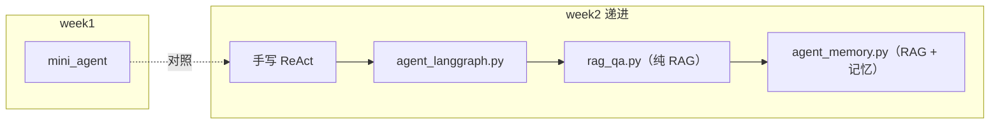
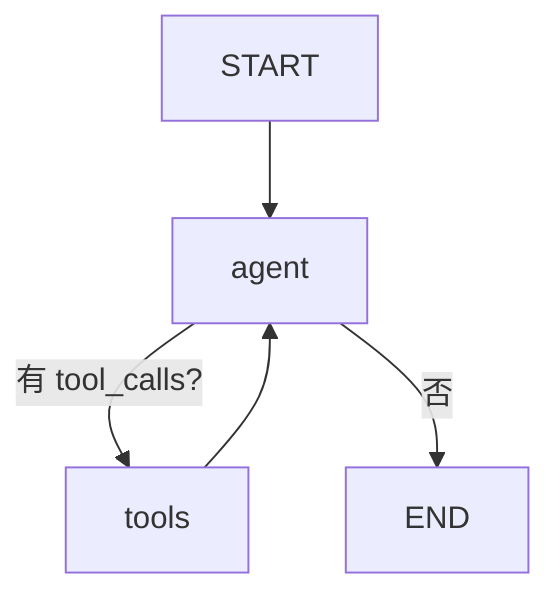
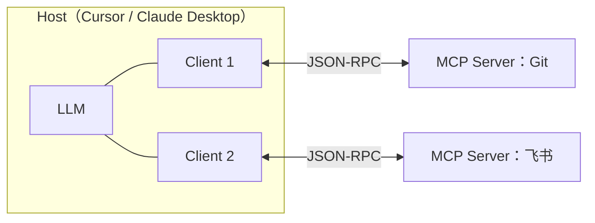
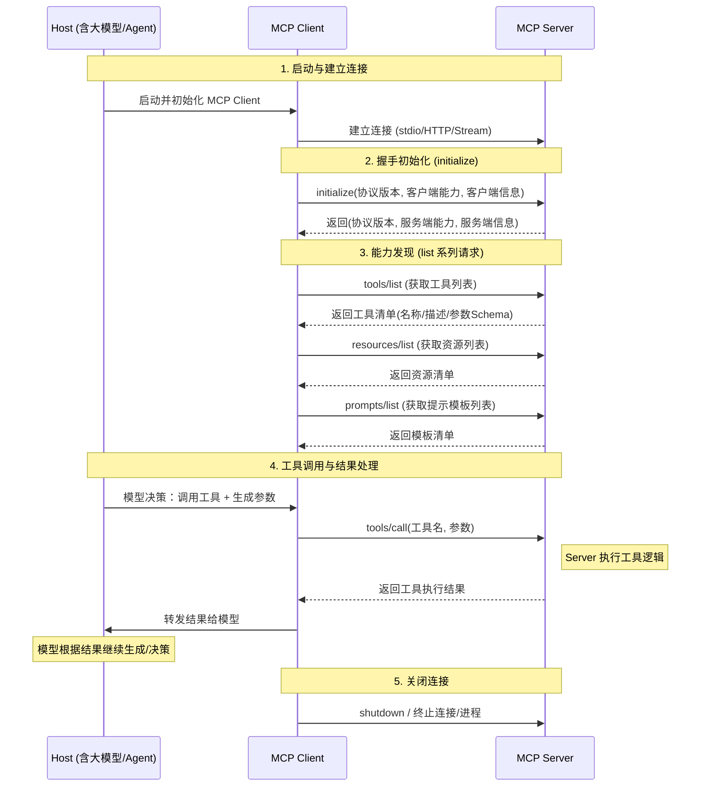

# 第 2 周：框架 + RAG

> 目标：掌握 LangGraph 编排、RAG 检索增强与 Agent 记忆机制。

## 快速开始

```bash
cd experiments
source .venv/bin/activate
pip install -r requirements.txt   # 含 week2 新依赖
# 确保 experiments/.env 已配置 DEEPSEEK_API_KEY

# 单元测试（TDD，无需 API）
pytest tests/ -v

cd week2
python agent_langgraph.py
python rag_qa.py
python agent_memory.py   # 多轮 CLI，输入 quit 退出
```

**首次运行 RAG**：会下载 FastEmbed 模型 `BAAI/bge-small-zh-v1.5`，请保持网络畅通。

## 学习路径




| 顺序  | 文件                   | 对应 checklist |
| --- | -------------------- | ------------ |
| 1   | `agent_langgraph.py` | 1.2, 1.3     |
| 2   | `rag_qa.py`          | 2.1–2.4      |
| 3   | `agent_memory.py`    | 3.1–3.3      |


---

## 1. 框架入门

### 1.1 框架选型对比


| 框架             | 擅长                             | 本周角色       |
| -------------- | ------------------------------ | ---------- |
| **LangGraph**  | Agent 状态机、循环、分支                | 主力编排       |
| **LangChain**  | Loader、Splitter、VectorStore 积木 | RAG 管线     |
| **LlamaIndex** | 文档索引抽象                         | 了解即可，本次不默认 |


### 1.2 实验：agent_langgraph.py

**运行**：`python agent_langgraph.py`

**对照 week1**：打开 `week1/mini_agent.py`，比较：

- `for` 循环 → Graph 的 `agent` / `tools` 节点
- `if tool_calls` → `conditional_edges`
- `messages` 列表 → `State` + `add_messages`

**观察**：控制台中的多轮工具调用与 Final Answer。

### 1.3 Agent 编排概念




### 1.4 LangGraph 核心概念


| 概念                   | 作用                   | 本项目对应                                           |
| -------------------- | -------------------- | ----------------------------------------------- |
| **State**            | 图中流转的共享数据（TypedDict） | `AgentState`：`messages` + `rag_context`         |
| **Node**             | 接收 State、返回部分更新的函数   | `retrieve_node` / `agent_node` / `ToolNode`     |
| **Edge**             | 节点间的固定流转             | `add_edge("retrieve", "agent")`                 |
| **Conditional Edge** | 按函数返回值动态路由           | `route_after_agent`：有 tool_calls 走 tools，否则 END |
| **Reducer**          | 定义 State 字段的合并方式     | `Annotated[list, add_messages]`：追加而非覆盖消息        |
| **recursion_limit**  | 防止 agent↔tools 死循环   | `RECURSION_LIMIT = 8`                           |


**关键理解**：

- 节点返回 `{"messages": [response]}` 不是覆盖，而是经 `add_messages` reducer **追加**——这是 LangGraph 与普通 dict 更新最大的区别。
- `ToolNode` 是预制节点：自动解析上一条 AIMessage 的 `tool_calls`、执行对应工具、把结果包装成 `ToolMessage` 写回。
- 进阶（本周未用）：`Checkpointer` 可把每步 State 持久化，实现断点恢复、多会话（thread_id）、human-in-the-loop。

---

## 2. RAG 核心

### 2.1 Embedding

- 将文本变为向量，语义相近的文本向量距离更近
- 本实验默认：FastEmbed 本地模型 `BAAI/bge-small-zh-v1.5`（无需 PyTorch 2.4+）
- **维度**：bge-small 输出 512 维向量；维度越高表达力越强，但存储/计算成本越高
- **相似度度量**：常用余弦相似度（cosine）；Chroma 默认 L2 距离，对归一化向量两者等价
- **选型要点**：中文场景选中文/多语模型（bge-zh、m3e）；本地模型免 API 费用，API embedding（如 OpenAI `text-embedding-3`）免部署

### 2.2 向量数据库 Chroma

- 持久化目录：`week2/.chroma/`（已 gitignore）
- 流程：Document → embedding → 存储 → similarity_search
- **同类产品**：Chroma / FAISS（轻量本地）、Milvus / Qdrant / pgvector（生产级）；教学和原型用 Chroma 足够

### 2.3 RAG 流程

切分（`lib/rag.split_markdown`）→ 向量化 → 检索 → 注入 system prompt → LLM 生成

**切分（Chunking）参数权衡**：


| 参数                      | 太小               | 太大                  |
| ----------------------- | ---------------- | ------------------- |
| `chunk_size`（本项目 500）   | 语义被切碎，检索到的片段缺上下文 | 单块噪声多，且占满 prompt 预算 |
| `chunk_overlap`（本项目 50） | 跨块句子被截断丢信息       | 冗余存储、重复召回           |


本项目用字符窗口切分（教学简化）；生产常用 `RecursiveCharacterTextSplitter`（按段落/句子边界递归切）或按 Markdown 标题结构切。

**检索参数**：

- `k`：召回条数（本项目 k=2~3）。k 越大召回越全但噪声越多
- 进阶优化方向：相似度阈值过滤、MMR（多样性）、rerank 重排、混合检索（向量 + BM25 关键词）、查询改写（HyDE / multi-query）

**RAG 失效排查顺序**（对应思考题 2）：

1. 先看检索结果对不对（打印命中片段）——多数问题出在这里
2. 检索不准 → 先调 chunk 策略（成本低），再考虑换 embedding 模型
3. 检索准但回答差 → 调 prompt 或换生成模型

### 2.4 实验：rag_qa.py

**运行**：`python rag_qa.py`

**观察**：打印的 `[1] source=sample.md | ...` 检索片段。

**试一问**：`第 2 周的学习产出是什么？`

---

## 3. 记忆机制


| 类型  | 实现                   | 位置                         |
| --- | -------------------- | -------------------------- |
| 短期  | `trim_messages` 裁剪历史 | `lib/history.py`           |
| 长期  | `MemoryStore` JSON   | `week2/.memory/store.json` |
| 工具  | `remember_fact`      | `agent_memory.py`          |


### 3.1 短期记忆 = 会话内上下文（in-context）

- 本质是 State 里的 `messages` 列表，随每轮追加，直接进 prompt
- 必须控制长度（上下文窗口 + 成本），常见策略：
  - **滑动窗口**：保留最近 N 条（本项目 `trim_messages`，最简单）
  - **按 token 裁剪**：比按条数更精确
  - **摘要压缩**：旧对话总结成 summary 拼回 system（信息保留更好，多一次 LLM 调用）
- LangGraph 生产做法：`Checkpointer` 按 `thread_id` 持久化对话线程

### 3.2 长期记忆 = 跨会话外部存储（out-of-context）

通用模式：**写入外部存储 → 按需取回 → 拼进 prompt**


| 形态             | 存储     | 取回方式 | 例子                              |
| -------------- | ------ | ---- | ------------------------------- |
| 显式事实（profile）  | KV / 表 | 全量注入 | 本项目 `MemoryStore`（name=小明）      |
| 情景记忆（episodic） | 向量库    | 语义检索 | Mem0、Zep：历史对话 embedding 后按相关性召回 |
| 结构化记忆          | 知识图谱   | 图查询  | 用户偏好、实体关系                       |


**写入策略**两种：

- **LLM 主动写**：通过工具调用（本项目 `remember_fact`）——可控但依赖模型自觉
- **系统自动抽取**：每轮后台从对话中抽取事实入库——召回全但有噪声

**与 RAG 的边界**（对应思考题 3）：长期记忆存「关于用户的事实」（动态、个人），RAG 知识库存「领域知识/文档」（静态、共享）。两者技术栈可以相同（都可用向量库），但生命周期和写入方不同。

### 3.3 实验：agent_memory.py

**运行**：`python agent_memory.py`

**建议试炼**：

1. 问：`第 2 周产出是什么？`（测 RAG）
2. 说：`请记住 name 是小明`（测长期记忆）
3. 问：`我叫什么？`（测召回）

---

## 4. MCP 认知（结合本项目）

### 4.1 协议定位

**Model Context Protocol**：由 Anthropic 提出的开放协议，标准化「LLM 应用 ↔ 外部能力」的连接方式。
类比：MCP 之于 AI 工具，就像 **USB-C / LSP** 之于硬件 / 编辑器——一次实现，处处复用。


|     | Function Calling | MCP                    |
| --- | ---------------- | ---------------------- |
| 范围  | 应用内函数            | 进程外服务                  |
| 定义方 | 应用开发者逐个绑定        | Server 自描述，Host 动态发现   |
| 传输  | 进程内调用            | stdio / Streamable HTTP，跨进程 |
| 复用  | 每个应用重写一遍         | 一个 Server 可被任意 Host 复用 |
| 例子  | `get_weather()`  | Cursor 里的 Git / 飞书 MCP |


**与 Function Calling 的分工**（对应思考题 4）：Function Calling 是「模型决定调谁」的底层能力；MCP 是其上的**工具分发协议**——Host 启动时向各 Server 拉取工具清单，再以 function calling 的形式暴露给模型。两者互补，不是替代。

### 4.2 架构：Host / Client / Server



- **Host**：你用的 AI 应用（Cursor、Claude Desktop），负责管理模型与多个 Client。
- **Client**：Host 内为**每个 Server 各开一个**的连接器（1:1），负责握手与消息收发。
- **Server**：独立进程，自描述地暴露能力，可被任意 Host 复用。
- 通信协议：**JSON-RPC 2.0**。

### 4.3 三类能力

| 能力 | 谁来触发 | 类比 | 例子 |
| --- | --- | --- | --- |
| **Tools** | 模型自动调用 | POST 接口（有副作用） | 创建飞书文档、执行 git commit |
| **Resources** | 应用/用户挂载 | GET 接口（只读数据） | 读取某文件、数据库 schema |
| **Prompts** | 用户主动选用 | 预置模板 / slash 命令 | 「代码评审」提示词模板 |

### 4.4 连接生命周期

1. **启动**：Host 按配置拉起 Server 进程（stdio）或建连（HTTP）。
2. **握手 initialize**：双方交换协议版本与能力（capabilities）。
3. **发现 list**：Host 调 `tools/list`、`resources/list`、`prompts/list` 拿清单。
4. **调用 call**：模型决定调用 → Client 发 `tools/call` → Server 执行 → 返回结果。
5. **关闭**：会话结束，Host 终止连接 / 进程。



### 4.5 传输方式

| 传输 | 场景 | 说明 |
| --- | --- | --- |
| **stdio** | 本地 Server | Host 直接拉起子进程，走标准输入输出，最常见 |
| **Streamable HTTP** | 远程 / 共享 Server | 支持多客户端，可部署到服务器 |
| ~~HTTP+SSE~~ | 旧版 | 已 deprecated，新项目用 Streamable HTTP |

### 4.6 跑通一个 MCP 连接（checklist 4.2）

**路线 A（零代码，推荐先做）**：直接用 Cursor 已配的 MCP。本仓库已挂载 3 个真实 Server：

- `user-lark`（飞书）
- `user-eamodio.gitlens-extension-GitKraken`（Git）
- `cursor-ide-browser`（浏览器自动化）

验证：在 Cursor 里让 Agent「列出当前 git 改动」「读取某飞书文档」，观察它通过 MCP 工具完成。

**路线 B（写一个最小 Server，理解协议）**：用官方 Python SDK（FastMCP）。

```python
# echo_server.py    pip install "mcp[cli]"
from mcp.server.fastmcp import FastMCP

mcp = FastMCP("echo-demo")

@mcp.tool()
def echo(text: str) -> str:
    """原样返回输入文本，用于验证连接。"""
    return f"echo: {text}"

if __name__ == "__main__":
    mcp.run()   # 默认 stdio 传输
```

在 Cursor 的 `~/.cursor/mcp.json`（或项目级 `.cursor/mcp.json`）注册：

```json
{
  "mcpServers": {
    "echo-demo": {
      "command": "python",
      "args": ["/绝对路径/echo_server.py"]
    }
  }
}
```

重启 / 刷新后，让 Agent 调用 `echo` 工具，看到 `echo: ...` 即连接成功。

### 4.7 常见坑

| 问题 | 原因 | 解决 |
| --- | --- | --- |
| Server 不出现 | 配置路径错 / 进程启动失败 | 用绝对路径；命令行先单独跑通 Server |
| 工具调用无响应 | stdio 里混入了 print 日志 | stdio 模式日志走 stderr，别污染 stdout |
| 权限/安全顾虑 | Server 拥有真实副作用 | 只装可信 Server；敏感操作加确认 |

> 第 2 周目标：理解协议 + 跑通一次连接（路线 A 即达标），无需深入自建生产级 Server。

---

## 5. 自动化测试（TDD）

```bash
cd experiments && pytest tests/ -v
```

测试覆盖：`history`、`memory_store`、`rag`、`routing`（使用 `FakeEmbeddings`，无需 API）。

---

## 6. 思考题

1. LangGraph 相比手写 `while` 循环，最大收益是什么？代价是什么？
2. RAG 检索不准时，应先调 chunk 还是换 embedding？
3. 长期记忆和 RAG 知识库各适合存什么？
4. MCP 与 Function Calling 在架构上如何分工？
5. MCP 的 stdio 与 Streamable HTTP 各适合什么场景？

---

## 7. 常见坑


| 问题                         | 原因                  | 解决                                    |
| -------------------------- | ------------------- | ------------------------------------- |
| `ModuleNotFoundError: lib` | 未在 week2 或未跑 pytest | `cd week2` 或从 `experiments/` 跑 pytest |
| 模型下载失败                     | 网络/HF 访问            | 配置镜像或换 API embedding                  |
| Chroma 锁文件                 | 多进程写同一目录            | 删除 `.chroma` 重建                       |
| Agent 不记名字                 | 未调用 `remember_fact` | 明确说「请记住 name=…」                       |


---

## 8. 下周预告

第 3 周：流式 SSE、健壮性、LangSmith/Langfuse 可观测性。